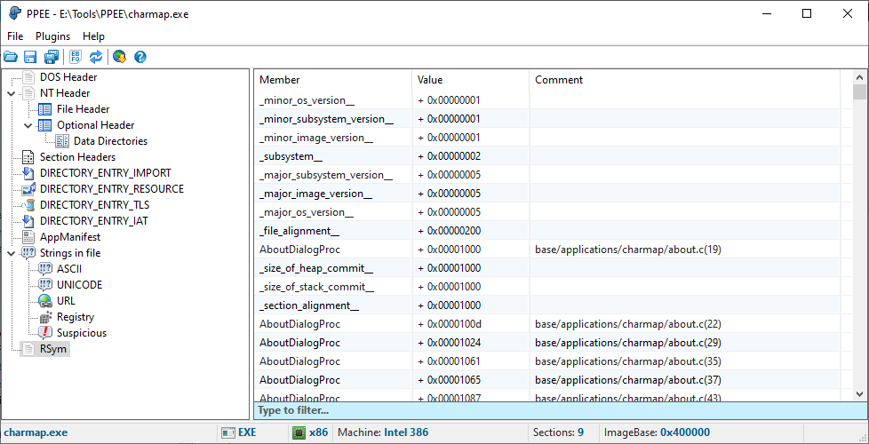

# PPEE_RSym
Display ReactOS RSym data in [PPEE (puppy)](https://www.mzrst.com/)

## Usage
* Build the project
* Drop the dll in the directory where PPEE is installed
* Start the plugin from the 'Plugins' menu

## What is RSym data?
RSym (or rossym) data is custom format for debug data, meant to be compact. 
Filename and line-numbers are stored in a way that allows the [translation of a memory address](https://git.reactos.org/?p=reactos.git&a=search&h=HEAD&st=grep&s=print_offset) to a file and line-number in the [ReactOS repository](https://github.com/reactos/reactos).

## Example

## TODO
- [ ] Filtering data does not work yet
